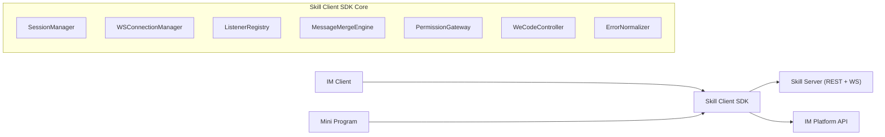
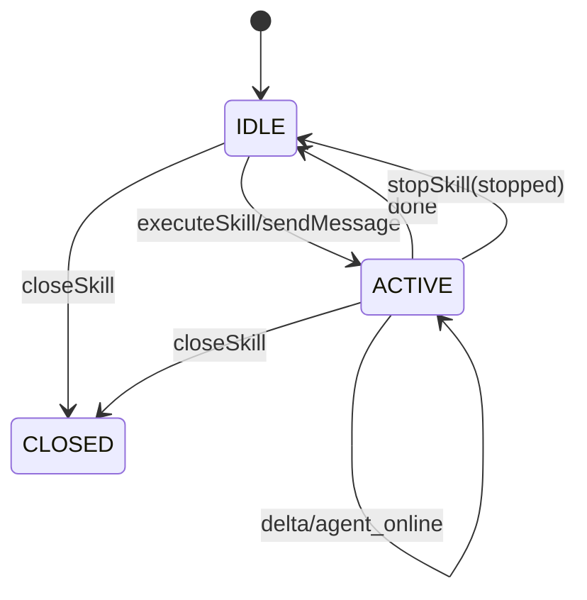
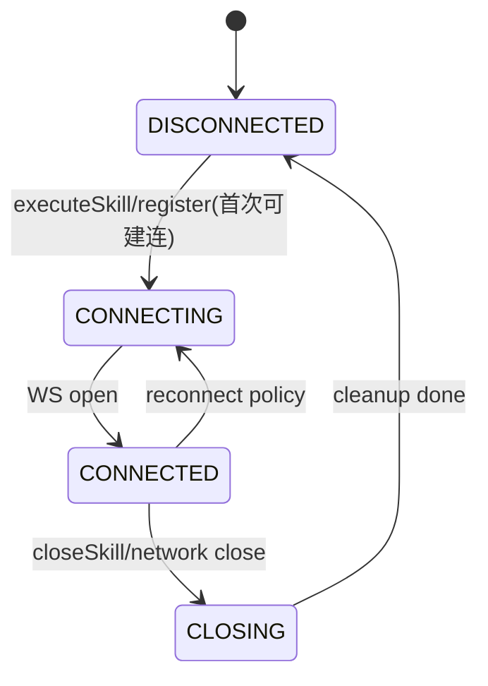

# Skill Client SDK 架构设计文档

## 1. 文档信息
- 文档版本：v1.0（评审稿）
- 事实来源：`documents/skillSdk/SkillClientSdkInterface.md`
- 约束来源：2026-03-07 评审结论（PRD 第1轮）
- 产出日期：2026-03-07

## 2. 架构目标与原则
## 2.1 架构目标
- 在不新增业务接口前提下，统一 13 个 SDK 能力的执行语义与状态语义。
- 保证多轮对话与流式消息处理的时序安全，不因监听注册顺序丢消息。
- 明确 SDK 与 Skill Server / IM / 小程序的职责边界，降低联调歧义。

## 2.2 设计原则
- 契约优先：接口签名、状态机、错误对象统一。
- 会话隔离：每个 session 独立维护连接态、监听器、流式缓存。
- 回调可靠：事件分发可重入，单监听器异常不影响其他监听器。
- 最小副作用：`stopSkill` 中断本轮生成，不关闭会话。
- 显式连接：`onSessionStatusChange` 不负责建连，仅消费既有连接事件。

## 3. 逻辑架构
## 3.1 组件视图


## 3.2 核心模块职责
| 模块 | 职责 | 关联接口 |
|---|---|---|
| SessionManager | 会话上下文管理、状态维护、生命周期编排 | executeSkill / closeSkill / stopSkill / sendMessage / regenerateAnswer |
| WSConnectionManager | WS 建连、断连、重连、心跳、连接复用 | executeSkill / registerSessionListener / closeSkill |
| ListenerRegistry | 监听器注册/移除/分发，支持同 session 多监听器 | registerSessionListener / unregisterSessionListener / onSessionStatusChange |
| MessageMergeEngine | 历史消息分页与流式缓存合并、去重 | getSessionMessage |
| PermissionGateway | 权限请求回复编排、结果回写 | replyPermission |
| WeCodeController | 小程序 close/minimize 控制与状态事件派发 | controlSkillWeCode / onSkillWecodeStatusChange |
| ErrorNormalizer | 将 HTTP/WS/业务异常归一为统一错误对象 | 全接口 |

## 3.3 运行边界
- SDK 内部维护 session 级上下文，不持久化跨端长期存储。
- 历史消息来源以 Skill Server REST 为准，本地仅缓存流式增量用于拼装展示。
- IM 投递由服务端转发，SDK 仅发起调用并处理结果语义。

## 4. 公共契约章节（与 PRD 对齐）
## 4.1 接口能力矩阵
| 接口分组 | 能力 | 依赖 |
|---|---|---|
| 会话执行 | executeSkill / sendMessage / regenerateAnswer / stopSkill / closeSkill | REST + WS |
| 监听回调 | registerSessionListener / unregisterSessionListener / onSessionStatusChange / onSkillWecodeStatusChange | WS + 本地事件 |
| 消息访问 | getSessionMessage | REST + 本地流式缓存 |
| 外部协同 | sendMessageToIM / replyPermission / controlSkillWeCode | REST + 宿主控制 |

## 4.2 会话状态机映射


状态映射约束：
- 会话实体状态：`ACTIVE / IDLE / CLOSED`。
- 执行状态回调：`executing / stopped / completed`。
- `stopped` 只描述“本轮执行中断”，不等价于 `CLOSED`。

## 4.3 流式消息协议
- 消息类型：`delta` / `done` / `error` / `agent_offline` / `agent_online`
- 架构约束（评审后定稿）：
  - `StreamMessage.sessionId` 设为必填，用于多会话并发路由。
  - `seq` 在单 session 内单调递增，用于丢包与乱序检测。
  - `done` 可携带 `usage`，用于统计和展示。

建议消息结构：
```typescript
interface StreamMessage {
  sessionId: string;
  type: 'delta' | 'done' | 'error' | 'agent_offline' | 'agent_online';
  seq: number;
  content: string;
  usage?: { inputTokens?: number; outputTokens?: number };
}
```

## 4.4 一致性问题与决策结果
1. `closeSkill`：无入参（已决策）。
2. `stopSkill`：真实语义为“停止本轮生成”，非关闭会话（已决策）。
3. `SkillSession` 主键字段：统一使用 `id`（已决策）。
4. `userId`：SDK 层统一 `string`（已决策）。
5. `onSessionStatusChange`：无现有 WS 时不允许内部触发建连（已决策）。

## 5. 关键时序设计
## 5.1 首次执行（executeSkill）
1. REST 创建会话（返回 `SkillSession.id`）。
2. 建立 session 对应 WS 连接。
3. 发送首条 `skillContent`。
4. 分发 `delta/done/error` 给监听器。

## 5.2 多轮对话（sendMessage）
1. 校验会话非 `CLOSED`。
2. REST 发送用户消息。
3. 使用既有 WS 接收并分发流式响应。

## 5.3 停止本轮（stopSkill）
1. 调用停止动作（MVP 兼容现网 `DELETE /api/skill/sessions/{sessionId}`）。
2. 终止当前流式分发，回调状态为 `stopped`。
3. 若后续发送返回 404/409，统一映射为 `SESSION_TERMINATED_AFTER_STOP`，由前端决定是否引导重建会话。

## 5.4 关闭会话连接（closeSkill）
1. 关闭 SDK 管理的全部会话连接。
2. 清理全部监听器与流式缓存。
3. 同步清空全部 SessionStore 内存上下文。

## 5.5 权限确认（replyPermission）
1. 前端接收权限请求并展示确认 UI。
2. 用户批准/拒绝后调用权限回复接口。
3. 结果回写会话流程并产生日志事件。

## 5.6 断线恢复
1. 识别断线原因（网络抖动/服务端关闭）。
2. 连接恢复后按 `sessionId + seq` 校正消息连续性。
3. 如有缺口，触发 `getSessionMessage` 做补齐。

## 6. 数据与状态模型
## 6.1 核心数据结构
```typescript
type SessionLifecycle = 'ACTIVE' | 'IDLE' | 'CLOSED';
type ExecutionStatus = 'executing' | 'stopped' | 'completed';
type ConnectionState = 'DISCONNECTED' | 'CONNECTING' | 'CONNECTED' | 'CLOSING';

interface SessionContext {
  id: string;
  userId: string;
  lifecycle: SessionLifecycle;
  executionStatus?: ExecutionStatus;
  connectionState: ConnectionState;
  lastSeq?: number;
}

interface ListenerSet {
  onMessage: Set<Function>;
  onError: Set<Function>;
  onClose: Set<Function>;
  onStatus: Set<Function>;
}

interface StreamAccumulator {
  sessionId: string;
  content: string;
  seq: number;
  isStreaming: boolean;
  updatedAt: number;
}
```

## 6.2 状态存储边界
- `SessionContext`：内存级，进程存活期有效。
- `ListenerSet`：内存级，按 sessionId 建索引。
- `StreamAccumulator`：内存级临时缓存，供 `getSessionMessage` 合并视图。
- `closeSkill` 成功后，上述内存态按全量会话清空。

## 7. 失败处理设计
## 7.1 统一错误对象结构（采纳）
```typescript
interface SkillSdkError {
  code: string;
  message: string;
  httpStatus?: number;
  retriable: boolean;
  source: 'REST' | 'WS' | 'SDK';
  sessionId?: string;
  timestamp: number;
}
```

## 7.2 错误映射与重试
- 4xx：默认不重试（参数错误、会话关闭、权限冲突）。
- 5xx / WS 瞬时错误：指数退避重试（受最大次数和超时窗口控制）。
- `agent_offline`：业务级可重试，不做底层无限重连。

## 7.3 幂等策略
- `registerSessionListener`：同引用重复注册不重复生效。
- `unregisterSessionListener`：移除不存在监听器返回可处理错误，不影响其他监听器。
- `closeSkill`：重复调用应可安全返回。

## 8. 连接生命周期设计


补充约束：
- `onSessionStatusChange` 仅订阅已有连接事件，不触发建连。
- 断线后恢复由 `WSConnectionManager` 统一处理。

## 8.1 ConnectionPolicy（MVP 采纳）
```typescript
interface ConnectionPolicy {
  maxRetryCount: 5;
  backoffInitialMs: 1000;
  backoffMaxMs: 5000;
  heartbeatIntervalMs: 15000;
  disconnectThresholdMs: 30000;
}
```

约束：
- 通过 SDK 初始化参数注入，支持按环境覆写（dev/test/prod）。
- 若调用方未显式传入，使用以上默认值。

## 9. 可观测性与审计
- 指标：接口成功率、首包时延、回调丢失率、重连次数、权限确认闭环时长。
- 新增：`dispatchLatencyMs`（WS 收包到监听器回调完成耗时）。
- 日志：`sessionId`、`seq`、`messageType`、`error.code`、`connectionState`。
- 审计：权限确认必须记录 `permissionId + approved + operator + timestamp`。

## 10. 架构验收用例（与 PRD 共用）
1. 首次执行技能到流式完成闭环。
2. 监听先注册/后注册两种时序不丢消息。
3. 多轮对话连续发送与并发回调分发。
4. `stopSkill` 后继续对话行为校验。
5. `closeSkill` 后资源释放与重复关闭处理。
6. 分页历史与流式缓存合并去重。
7. 权限确认批准/拒绝双路径。
8. `sendMessageToIM` 成功与典型失败码。
9. 小程序 `close/minimize` 控制与状态回调。
10. 断线重连与状态恢复一致性。
11. 错误码映射与前端提示一致性。
12. 向后兼容：旧调用方最小改动可用。

## 11. 评审结论（已定稿）
1. `closeSkill` 无入参，作用域为 SDK 管理的全部会话连接。
2. `stopSkill` 语义是停止本轮生成；服务端维持现网 `DELETE /sessions/{id}`，MVP 暂不改造。
3. `SkillSession.id` 类型统一为 `string`。
4. `closeSkill` 执行后同步清空全部 SessionStore 内存上下文。
5. `SESSION_TERMINATED_AFTER_STOP` 的交互由前端控制，SDK 不内置弹窗逻辑。
6. Listener 熔断自动恢复本期不处理。

## 12. MVP 采纳项（已定稿）
1. `ConnectionPolicy` 作为 SDK 初始化参数透出，并支持环境覆写。
2. ListenerRegistry 启用逐监听器 `try-catch` + 熔断计数分发隔离。
3. 增加 `dispatchLatencyMs` 指标。
4. `getSessionMessage(includeStreaming=false)` 本期不做。
